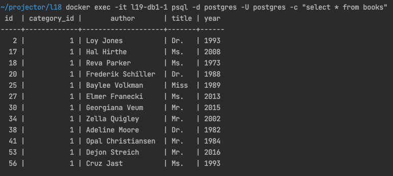
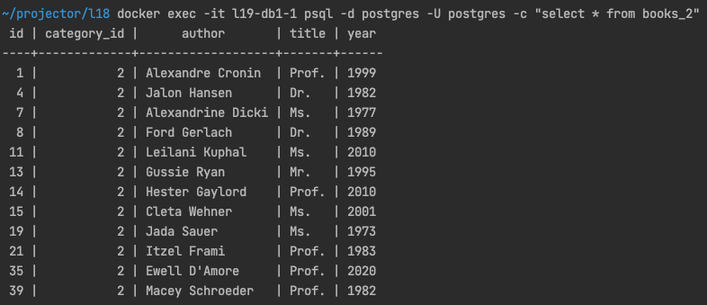
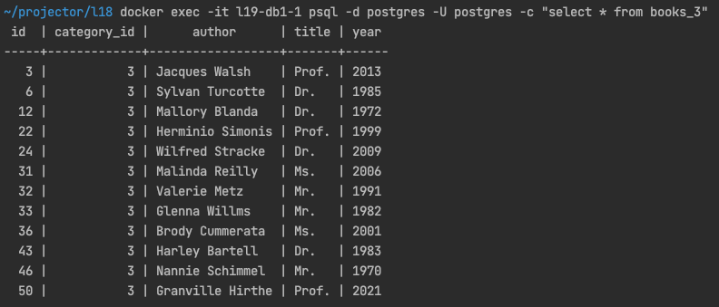

# Database sharding

Run ```docker-compose up -d``` to launch containers.

## Vertical sharding

Create table
```shell
docker exec -it l19-db1-1 psql -d postgres -U postgres -c "CREATE TABLE IF NOT EXISTS books (id SERIAL, category_id  int not null, author character varying not null, title character varying not null, year int not null)"
```

Create shards
```shell
docker exec -it l19-db1-1 psql -d postgres -U postgres -c "CREATE TABLE books_2 (CHECK ( category_id = 2 )) INHERITS ( books )" 

docker exec -it l19-db1-1 psql -d postgres -U postgres -c "CREATE TABLE books_3 (CHECK ( category_id = 3 )) INHERITS ( books )" 
```

Create rules
```shell
docker exec -it l19-db1-1 psql -d postgres -U postgres -c " CREATE RULE books_insert_to_category_2 AS ON INSERT TO books WHERE ( category_id = 2 ) DO INSTEAD INSERT INTO books_2 VALUES (NEW.*);"

docker exec -it l19-db1-1 psql -d postgres -U postgres -c " CREATE RULE books_insert_to_category_3 AS ON INSERT TO books WHERE ( category_id = 3 ) DO INSTEAD INSERT INTO books_3 VALUES (NEW.*);"
```

Add index
```shell
docker exec -it l19-db1-1 psql -d postgres -U postgres -c "CREATE INDEX books_category_id_idx ON books USING btree(category_id)" 
```

Insert data:
```shell
docker exec -it l19-php-1 php index.php     
```
Result: 





### Tests

Insert 10**6 records with vertical sharding implemented ~ **252 sec**


## Horizontal sharding

Run ```bash horizontal_sharding.sh``` to init tables, rules etc. The script does the following: 

Creates databases with constrains on shards, add indexes

```shell
docker exec -it l19-db2-1 psql -d postgres -U postgres -c "CREATE TABLE IF NOT EXISTS books (id serial not null primary key, category_id int not null, CONSTRAINT category_id_check CHECK (category_id = 1), author character varying not null, title character varying not null, year int not null)"

docker exec -it l19-db3-1 psql -d postgres -U postgres -c "CREATE TABLE IF NOT EXISTS books (id serial not null primary key, category_id int not null, CONSTRAINT category_id_check CHECK (category_id = 2), author character varying not null, title character varying not null, year int not null)"

docker exec -it l19-db2-1 psql -d postgres -U postgres -c "CREATE INDEX books_category_id_idx ON books USING btree(category_id)"  

docker exec -it l19-db3-1 psql -d postgres -U postgres -c "CREATE INDEX books_category_id_idx ON books USING btree(category_id)"         
```

#### Creates Server, create extension

```shell
 docker exec -it l19-db1-1 psql -d postgres -U postgres -c "CREATE EXTENSION postgres_fdw;"
```

#### creates servers for db2 and db3

```shell
 docker exec -it l19-db1-1 psql -d postgres -U postgres -c "CREATE SERVER books_1_server FOREIGN DATA WRAPPER postgres_fdw OPTIONS( host 'db2', port '5432', dbname 'postgres' );" 
 
 docker exec -it l19-db1-1 psql -d postgres -U postgres -c "CREATE SERVER books_2_server FOREIGN DATA WRAPPER postgres_fdw OPTIONS( host 'db3', port '5432', dbname 'postgres' );"
```

#### creates user mappings

```shell
docker exec -it l19-db1-1 psql -d postgres -U postgres -c "CREATE USER MAPPING FOR postgres SERVER books_1_server OPTIONS (user 'postgres', password 'admin123');" 

docker exec -it l19-db1-1 psql -d postgres -U postgres -c "CREATE USER MAPPING FOR postgres SERVER books_2_server OPTIONS (user 'postgres', password 'admin123');" 
```

#### creates foreign tables 

```shell
docker exec -it l19-db1-1 psql -d postgres -U postgres -c "CREATE FOREIGN TABLE books_1 (id SERIAL, category_id int not null, author character varying not null, title character varying not null, year int not null ) SERVER books_1_server OPTIONS (schema_name 'public', table_name 'books');"

docker exec -it l19-db1-1 psql -d postgres -U postgres -c "CREATE FOREIGN TABLE books_2 (id SERIAL, category_id int not null, author character varying not null, title character varying not null, year int not null ) SERVER books_2_server OPTIONS (schema_name 'public', table_name 'books');"
```

#### creates view, add rules
```shell
docker exec -it l19-db1-1 psql -d postgres -U postgres -c "CREATE VIEW books AS SELECT * FROM books_1 UNION ALL SELECT * FROM books_2"

docker exec -it l19-db1-1 psql -d postgres -U postgres -c "CREATE RULE books_insert AS ON INSERT TO books DO INSTEAD NOTHING; CREATE RULE books_update AS ON UPDATE TO books DO INSTEAD NOTHING; CREATE RULE books_delete AS ON DELETE TO books DO INSTEAD NOTHING;"

docker exec -it l19-db1-1 psql -d postgres -U postgres -c "CREATE RULE books_insert_to_1 AS ON INSERT TO books WHERE ( category_id = 1 ) DO INSTEAD INSERT INTO books_1 VALUES (NEW.*); CREATE RULE books_insert_to_2 AS ON INSERT TO books WHERE ( category_id = 2 ) DO INSTEAD INSERT INTO books_2 VALUES (NEW.*);"
```

Insert data:
```shell
docker exec -it l19-php-1 php index.php     
```

### Tests

Insert 10**6 records with vertical sharding implemented ~ **863 sec**
Read **2 sec**